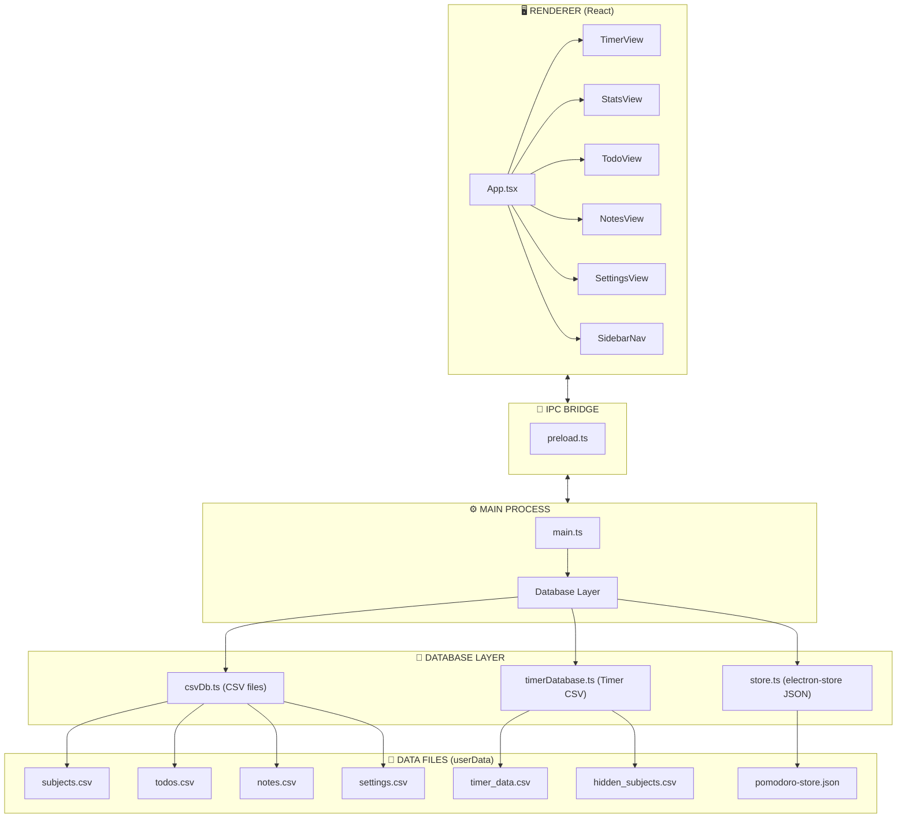

# Clarity - Project Mental Map & Documentation

> **Clarity** is an Electron-based productivity app featuring a Pomodoro timer, statistics tracking, todos, notes, and customizable backgrounds.

---

## 🗺️ Architecture Overview



---

## 📁 Folder Structure

```
clarity/
├── src/                          # Main process code
│   ├── main.ts                   # Electron main entry, IPC handlers
│   ├── preload.ts                # Context bridge (exposes electronAPI)
│   ├── App.tsx                   # React root component
│   ├── renderer.tsx              # React entry point
│   ├── db.ts                     # Re-export of database
│   ├── timeUtils.ts              # Time formatting utilities
│   ├── notifications.ts          # Notification & reminder system
│   ├── database/                 # All database modules
│   │   ├── index.ts              # Entry point, migrations, exports
│   │   ├── csvDb.ts              # CSV database for subjects/todos/notes/settings
│   │   ├── timerDatabase.ts      # Timer-specific CSV database
│   │   ├── store.ts              # electron-store for sessions/stats
│   │   ├── crud.ts               # Generic CRUD operations
│   │   ├── todos.ts              # Todo-specific helpers
│   │   ├── timer.ts              # Timer session helpers
│   │   ├── background.ts         # Background image storage
│   │   └── aggregators.ts        # Stats aggregation functions
│   ├── styles/                   # Global styles
│   └── types/                    # TypeScript type definitions
│
├── components/                   # React components
│   ├── views/                    # Main view components
│   │   ├── TimerView.tsx         # Pomodoro timer (523 lines)
│   │   ├── StatsView.tsx         # Statistics wrapper
│   │   ├── StatsDisplay.tsx      # Statistics charts/tables
│   │   ├── TodoView.tsx          # Task management
│   │   ├── NotesView.tsx         # Notes editor
│   │   └── SettingsView.tsx      # Background settings
│   ├── TimerCard.tsx             # Timer display component
│   ├── SetupCard.tsx             # Timer setup/config
│   ├── SidebarNav.tsx            # Navigation sidebar
│   ├── Check.tsx                 # Checkbox component
│   └── ui/                       # shadcn/ui components (18 files)
│
├── hooks/                        # Custom React hooks
│   ├── useBackground.ts          # View background management
│   ├── usePomodoroTimer.ts       # Timer state hook
│   └── use-mobile.ts             # Mobile detection
│
├── lib/                          # Utilities
│   └── utils.ts                  # cn() helper for Tailwind
│
├── assets/                       # Static assets
├── public/                       # Public files
├── resources/                    # Electron resources (icons, etc.)
└── docs/                         # Documentation (you are here)
```

---

## 🖥️ Views (Features)

### 1. ⏱️ Timer View (`TimerView.tsx`)

**The core Pomodoro timer functionality.**

| Feature             | Description                                    |
| ------------------- | ---------------------------------------------- |
| **Phases**          | Focus, Short Break, Long Break                 |
| **Subjects**        | Track time per subject/topic                   |
| **Auto-save**       | Saves progress every minute when running       |
| **Hidden subjects** | Can hide subjects from dropdown (localStorage) |
| **Configurable**    | Focus/break durations stored in localStorage   |

**Key State:**

- `focusMinutes`, `shortBreakMinutes`, `longBreakMinutes`
- `currentPhase`: "focus" | "short_break" | "long_break"
- `subjects`: Array of subject names
- `selectedSubjectName`: Currently selected subject

**Data Flow:**

```
TimerView → window.electronAPI.timerDb.addOrUpdateTimerData() → timerDatabase.ts → timer_data.csv
         → window.electronAPI.saveSessionProgress() → store.ts → pomodoro-store.json
```

---

### 2. 📊 Stats View (`StatsView.tsx` + `StatsDisplay.tsx`)

**Displays tracked time statistics.**

| Feature               | Description                 |
| --------------------- | --------------------------- |
| **View Modes**        | Progress view, Table view   |
| **Date Filtering**    | Week, Month, Year, All Time |
| **Subject Breakdown** | Bar chart per subject       |
| **Daily Totals**      | Line chart over time        |

**Data Source:** Fetches sessions via `getSessionsForMonth()`

---

### 3. ✅ Todo View (`TodoView.tsx`)

**Task management with due dates and reminders.**

| Feature         | Description                  |
| --------------- | ---------------------------- |
| **Tasks**       | Add, complete, star, delete  |
| **Due Dates**   | Date + time picker           |
| **Reminders**   | Native OS notifications      |
| **Date Scoped** | Shows todos for current date |

**Data Flow:**

```
TodoView → window.electronAPI.addTodo() → main.ts IPC → csvDb.ts → todos.csv
```

---

### 4. 📝 Notes View (`NotesView.tsx`)

**Sticky note-style notes.**

| Feature             | Description                          |
| ------------------- | ------------------------------------ |
| **Create/Delete**   | Add/remove notes                     |
| **Colors**          | 8 color options per note             |
| **Auto-save**       | Debounced save on content change     |
| **Title + Content** | Each note has editable title/content |

**Data Flow:**

```
NotesView → window.electronAPI.insert("notes", data) → csvDb.ts → notes.csv
```

---

### 5. ⚙️ Settings View (`SettingsView.tsx`)

**Customize view backgrounds.**

| Feature                  | Description                                |
| ------------------------ | ------------------------------------------ |
| **Per-view backgrounds** | Set image for each view                    |
| **File upload**          | Supports jpg, png, gif, webp, bmp          |
| **Size limit**           | 10MB max                                   |
| **Fallback**             | Falls back to timer background if none set |

---

## 💾 Database Architecture

### Current Storage System (CSV-based)

#### 1. `csvDb.ts` - Main CSV Database

Manages: `subjects.csv`, `todos.csv`, `notes.csv`, `settings.csv`

```typescript
interface Subject {
  id;
  name;
  created_at;
}
interface Todo {
  id;
  date;
  text;
  done;
  starred;
  due_date;
  created_at;
}
interface Note {
  id;
  title;
  content;
  color;
  created_at;
}
interface Setting {
  key;
  value;
}
```

#### 2. `timerDatabase.ts` - Timer-specific Database

Manages: `timer_data.csv`, `hidden_subjects.csv`

```typescript
interface TimerData {
  id;
  subject;
  date;
  total_minutes;
  last_updated;
}
interface HiddenSubject {
  id;
  subject;
  hidden_at;
}
```

#### 3. `store.ts` - Electron Store (JSON)

File: `pomodoro-store.json`

```typescript
interface Schema {
  schemaVersion: number;
  settings: { minutesPerPomodoro; minutesPerBreak; minutesPerLongBreak };
  subjectTotals: Record<string, { totalTime: number }>;
  totalTime: number;
  dailyStats: DailyStat[];
  sessions: SessionRow[];
}
```

### Data File Locations

All stored in Electron's `userData` path:

- **Windows:** `%APPDATA%/clarity/`
- **macOS:** `~/Library/Application Support/clarity/`
- **Linux:** `~/.config/clarity/`

---

## 🔌 IPC Communication

### Bridge Pattern

```
Renderer → preload.ts (contextBridge) → main.ts (ipcMain.handle) → Database
```

### Key API Endpoints (`window.electronAPI`)

| Category          | Methods                                                                                                                    |
| ----------------- | -------------------------------------------------------------------------------------------------------------------------- |
| **Timer**         | `timerDb.addOrUpdateTimerData()`, `timerDb.getAllSubjects()`, `timerDb.hideSubject()`, `timerDb.deleteSubjectCompletely()` |
| **Sessions**      | `startSession()`, `completeSession()`, `saveSessionProgress()`, `getAllSessions()`, `getSessionsForMonth()`                |
| **Todos**         | `getTodosByDate()`, `addTodo()`, `updateTodo()`, `deleteTodo()`, `getStarredTodos()`                                       |
| **Notes**         | `query("notes")`, `insert("notes")`, `update("notes")`, `remove("notes")`                                                  |
| **Backgrounds**   | `setViewBackground()`, `getViewBackground()`, `removeViewBackground()`, `getAllBackgrounds()`                              |
| **Notifications** | `notify()`, `playSound()`, `addReminder()`, `removeReminder()`                                                             |

---

## 🚨 Known Issues / Tech Debt

1. **Dual Data Storage**: Timer data stored in BOTH `timerDatabase.ts` (CSV) AND `store.ts` (JSON) - duplicated logic
2. **No User Authentication**: Single-user local storage only
3. **No Cloud Sync**: All data is local
4. **Mixed Conventions**: Some views use direct IPC, others use generic CRUD
5. **Large Components**: `TimerView.tsx` is 523 lines, `StatsDisplay.tsx` is 600+ lines

---

## 🔜 Planned Migration: CSV → Supabase

### Current State

```
Local CSV/JSON Files → File System
```

### Target State

```
Supabase PostgreSQL → Cloud Database
```

### Migration Considerations:

1. **Users Table** - Add authentication
2. **RLS (Row Level Security)** - Ensure users only see their data
3. **Schema Design** - Map existing CSV structures to SQL tables
4. **Offline Support** - Consider local-first with sync
5. **Migration Script** - Import existing CSV data

---

## 📋 Quick Reference

### Run Commands

```bash
# Development
npm run start

# Build
npm run build
npm run make        # Create distributable

# Lint
npm run lint
```

### Tech Stack

- **Framework:** Electron (Vite)
- **Frontend:** React + TypeScript
- **Styling:** Tailwind CSS + shadcn/ui
- **Storage:** CSV (papaparse) + electron-store
- **Build:** Electron Forge
